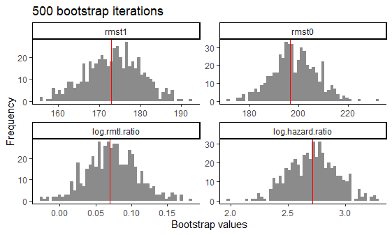

<!-- badges: start -->
[](https://cran.r-project.org/package=precmed)
[](https://cran.r-project.org/package=precmed)
<!-- badges: end -->
```{r setup, include=FALSE}
knitr::opts_chunk$set(echo = TRUE)
knitr::opts_chunk$set(comment = "#>", collapse = TRUE)
options(rmarkdown.html_vignette.check_title = FALSE) #title of doc does not match vignette title
doc.cache <- T #for cran; change to F
```

<h1>precmed: Precision Medicine in R</h1>
A doubly robust precision medicine approach to estimate and validate conditional average treatment effects

# Load required packages
```{r, echo = T, message=F}
library(precmed)
library(dplyr)
library(ggplot2)
```


# Examples with survival outcomes

We use the following simulated data to demonstrate the `precmed` functions for survival outcomes. The data set `survivalExample` was simulated based on real-world claims data in multiple sclerosis and has 4,000 observations and 9 variables.

-   We will use `y` as the survival outcome, which is the number of days until the first relapse or censoring, whichever comes first.

-   We will use `d` as the event indicator, where $1$ represents an event and $0$ represents censoring. The censoring rate is about 84%.

-   We will use `trt` as the treatment variable, which has 2 drugs (drug0 and drug1).

-   The rest of the variables are baseline patient characteristics. Variable `age` is centered at 48 years old. The medical costs in the year prior to treatment initiation `previous_cost` is centered at 14,362 USD and scaled with standard deviation 24,266 USD.

```{r data, echo = F, eval = T, include = T}
str(survivalExample)
```

## Internal validation via `catecv()` 

We first run the internal validation to compare 5 scoring methods. This is done with the function `catecv()`. This first step gives results in the form of a "precmed" object which will be used in the next steps to compare the performance of the scoring methods.

The mandatory arguments in `catecv()` are `response`, `data`, `score.method`, `cate.model`, and `ps.model`. They must be specified by the user.

* The `response` argument specifies the type of outcome in the data. For survival outcomes, `response` = "survival". This informs the function of the necessary arguments and methods to use.

* The argument `data` indicates the data frame in which the outcome, treatment and covariates specified in either `cate.model` or `ps.model` should be fetched. 

* The `score.method` argument specifies the precision medicine (PM) methods to be used to calculate the CATE scores. There are a total of 5 scoring methods implemented:

    *   `poisson` fits a Poisson model separately by treatment group.

    *   `boosting` uses gradient boosted regression models (GBM)
        separately by treatment group.
        
    *   `randomForest` fits a random forest model by treatment group.

    *   `twoReg` implements the doubly robust two regressions estimator
        in @yadlowsky2020estimation.

    *   `contrastReg` implements the doubly robust contrast regression
        estimator from @yadlowsky2020estimation.
    
For this toy example we selected `randomForest` and `contrastReg` to limit run time. 

* The argument `cate.model` specifies the CATE model as a formula, with the survival object from the `survival` package, `Surv(y, d)`, supplied on the left-hand side and the explanatory covariates supplied on the right-hand side. In the example below, we chose to specify to CATE as a linear combination of the following covariates: age, sex, medical costs in the year prior to treatment initiation, and number of relapses in the year prior to treatment initiation. Non-linear or interaction terms could also be included. Note that the treatment variable is not supplied in `cate.model` since this is an outcome model.

* The `ps.model` argument specifies the PS model as a formula, with the treatment variable `trt` on the left-hand side and the
    covariates (age and previous treatment in this example) on the right-hand side. The variable `trt` must be supplied as a numeric variable taking only 2 values, "1" for active treatment and "0" for control or comparator. If it is not the case, `catecv()` will stop with error if `trt` takes more than 2 distinct values or will automatically transform `trt` into a numeric variable. In this example, `trt` (a factor variable taking values "drug0" and "drug1") was transformed and a warning message was left to the user (see output below): `Variable trt was recoded to 0/1 with drug0->0 and drug1->1`. If the data are from a RCT, it suffices to specify `ps.model` = trt \~ 1. Note that the PS model is only used in the estimation of the 2 doubly robust methods (two and contrast regressions).
    
We also specified the following non-mandatory arguments to fit with the data and problem at hand: `initial.predictor.method`, `ipcw.model`, `verbose`, `followup.time`, `tau0`, `higher.y`, `cv.n`, `surv.min`, `seed`, and `plot.gbmperf`.

* `initial.predictor.method` specifies how predictions of the outcome are estimated in two regressions and contrast regression. Flexible models can be used such as GBM ("boosting"), random forests ("randomForest") or logistic regression ("logistic"). We chose "logistic" because it is relatively faster than boosting methods and random forest.

* The `ipcw.model` argument specifies the inverse proability of censoring weighting (IPCW) model as a formula, with the left-hand side empty and the covariates on the right-hand side. The IPCW model calculates the probability of being censored as weights to be included in the PM methods in order to correct for right censoring. In the example below, we chose to specify IPCW model as a linear combination of age, medical costs in the year prior to treatment initiation, and previous treatment. This argument can be left default as `NULL` if the user wants to use the same covariates provided in the outcome model `cate.model` plus the treatment variable.

* We only output the progress of the CV procedure (but not the full error messages and warnings) in the R console by setting `verbose` = 1.

* `followup.time` specifies the maximum follow-up time in the data. We set it default as `NULL`, which indicates unknown potential censoring time.

* `tau0` is the truncation time for defining restricted mean time lost (RMTL). We specified it as `NULL`, which automatically sets the truncation time as the maximum survival time in the data. 

* `higher.y` was set to `TRUE` because relapse is a negative event and longer time to first relapse is more desirable in our example. Hence, we are telling the function that subgroups of high responders to drug1 vs drug0 should have later onset of the first relapse. In other situation, higher outcomes may be more favorable for time to a positive event, e.g., time to discharge or time to improved disability. It is important for this argument to match with the nature of `y` outcome because it will affect how the subgroups are defined by the CATE scores and the performance metrics.

* We performed 5 CV iterations by specifying `cv.n` = 5. Typically, more CV iterations are desirable although associated with longer computational times.

* `surv.min` truncates the censoring probability estimated from the IPCW model with a lower limit to prevent extremely small censoring probabilities. It is recommended to choose a small positive value close to 0. We chose `0.025` in the example, which corresponds to the default value.

* We set a random seed `seed` = 999 to reproduce the results.

* We avoided generating the boosting performance plots by specifying `plot.gbmperf` = FALSE.

* When `verbose` = 1, progress messages are printed in the R console but errors and warnings are not printed. The current CV iteration is printed, followed by the steps of the CV procedure (splitting the data, training the models, validating the models). A timestamp and a progress bar are also displayed upon completion of a CV iteration. If `contrastReg` was selected as one of the methods in `score.method`, an additional line of output message will indicate whether the algorithm has converged.

There are many other non-mandatory arguments that `catecv()` can accept. Please see the [More Examples](Additional-examples.html) section for more examples and the Function description (`?catecvsurv`) for details. If you run into errors or warnings with your data, it might be helpful to go over the descriptions to see if you need to alter the default values. In this toy example, we keep the default values of the remaining arguments.

```{r example_catecv, eval = T, echo = T, cache = doc.cache}
tau0 <- with(survivalExample,
             min(quantile(y[trt == "drug1"], 0.95), quantile(y[trt == "drug0"], 0.95)))

output_catecv <- catecv(response = "survival",
                        data = survivalExample,
                        score.method = c("randomForest", "contrastReg"),
                        cate.model = survival::Surv(y, d) ~ age + female +
                                     previous_cost + previous_number_relapses,
                        ps.model = trt ~ age + previous_treatment,
                        initial.predictor.method = "logistic",
                        ipcw.model = NULL,
                        followup.time = NULL,
                        tau0 = tau0,
                        higher.y = TRUE,
                        surv.min = 0.025,
                        prop.cutoff = seq(0.6, 1, length = 5),
                        prop.multi = c(0, 0.5, 0.6, 1),
                        cv.n = 5,
                        seed = 999,
                        plot.gbmperf = FALSE,
                        verbose = 1)
```


The output of `catecv()` is an object of class "precmed" and here we named it `output_catecv`. It carries the relevant information to use in the next step of the workflow which selects the method (among those specified in the argument `score.method`) capturing the highest level of treatment effect heterogeneity. The output, which is described below, will be used in the functions `plot()`, `boxplot()` and `abc()`. 

For each method specified in the argument `score.method`, the following 4 groups of outputs are generated. We use the results from `randomForest` as an example.

**1. ATEs in nested subgroups of high responders**

This output stores the ATEs - the ratio of RMTL between drug1 vs drug0 in this example - in nested subgroups of patients of high responders to drug 1 in the training (`$ate.est.train.high.cv`) and validation (`$ate.est.valid.high.cv`) sets across all CV iterations. When `higher.y` = TRUE for survival outcomes, which is the case in this
example, lower CATE scores correspond to high responders to drug1. When `higher.y` = FALSE for survival outcomes, higher CATE scores correspond to high responders to drug1. Note that this is different for count outcomes. The direction of CATE scores depends on both `higher.y` and outcome type.

```{r example_print_catecv, eval = T, echo = T}
output_catecv$ate.randomForest$ate.est.train.high.cv
output_catecv$ate.randomForest$ate.est.valid.high.cv
```

The output is a matrix with columns corresponding to the CV iterations, labeled from 1 to `cv.n`, and rows corresponding to nested subgroups. The nested subgroups of patients are defined by the argument `prop.cutoff`. Here, we use `seq(0.6, 1, length = 5)` which defines nested subgroups with the 60%, 70%, 80%, 90% and 100% lowest (highest if `higher.y = FALSE`) CATE scores estimated by random forest. The rows in the output are labeled to reflect the user-specified proportions used to build the subgroups.

For example, in the training set and in the 4th CV iteration (4th column labeled "cv4"), the subgroup defined with the 80% lowest CATE scores (4th row labeled "prop0.8") has an estimated RMTL ratio of `r round(output_catecv$ate.randomForest$ate.est.train.high.cv[3,4], 3)`. In contrast, the subgroup defined with all patients (last row labeled "prop1") in the 4th CV iteration has an estimated RMTL ratio of `r round(output_catecv$ate.randomForest$ate.est.train.high.cv[5,4], 3)`.
<!-- This suggests that the CATE score estimated with random forests identifies high responders to drug 1 vs drug 0 because patients with the 50\% lowest estimated CATE score have a better (lower) RMTL ratio compared to all patients. If lower outcomes were preferable (as specified through the argument `higher.y`), subgroups would be defined with proportion of patients with *highest* estimated CATE score and *higher* RR would be better. -->

**2. ATEs in nested subgroups of low responders**

This output stores the ATEs in nested subgroups of *low responders* to drug1 in the training (`$ate.est.train.low.cv`) and validation (`$ate.est.valid.low.cv`) sets across all CV iterations. When `higher.y` = TRUE for survival outcomes, higher CATE scores correspond to low responders to drug1. When `higher.y` = FALSE for survival outcomes, lower CATE scores correspond to low responders to drug1. Again, this is
different for count outcomes. The direction of CATE scores depends on both `higher.y` and outcome type. 

```{r example_print_train_catecv, eval = T, echo = T}
output_catecv$ate.randomForest$ate.est.train.low.cv
```

The outputs are also matrices with columns corresponding to the CV iterations and rows corresponding to nested subgroups. 

The output for the low responders brings additional information to the user. It gives the ATEs in the complement of each nested subgroup of high responders. For example, the complement of the subgroup of high responders defined as patients with the 60% lowest (highest if `higher.y` = FALSE) estimated CATE scores is the subgroup of low
responders defined as patients with the 40% highest (lowest if `higher.y` = TRUE) estimated CATE scores, labeled as "prop0.4". In the training set and in the first CV iterations, the estimated RMTL ratio is `r round(output_catecv$ate.randomForest$ate.est.train.high.cv[2,1], 3)` in the 60% high responders to drug 1 and `r round(output_catecv$ate.randomForest$ate.est.train.low.cv[2,1], 3)` in the 40% low responders.

The 2 last rows have missing or infinite values and this can be due to many reasons. We record all errors and warnings and keep them as an element of the `cv` output. For example, we can use the following code to check specific errors and warnings of the first CV iteration (`$cv1`) using the random forest method (`$randomForest`) when estimating the ATE in the training sample in the low responder groups (`$est.train.low.cv`). It looks like there was no event observation in the 10% subgroup, possibly due to small sample size, which also relates to the convergence issue in the warning. Additionally, the warning for the 20% subgroup (`$warnings$'prop0.2'`) suggested that there was non-convergence of the Cox procedure and that the corresponding estimated ATE should be interpreted with caution.

```{r errwarn, eval = T, echo = T}
output_catecv$`errors/warnings`$randomForest$est.train.low.cv$cv1
output_catecv$`errors/warnings`$randomForest$est.valid.low.cv$cv1
```

**3. ATEs in mutually exclusive multi-category subgroups**

This output stores the ATEs in mutually exclusive multi-category subgroups of patients in the training (`$ate.est.train.group.cv`) and validation (`$ate.est.valid.group.cv`) sets across all CV iterations.

```{r example_print_group_catecv, eval = T, echo = T}
output_catecv$ate.randomForest$ate.est.train.group.cv
output_catecv$ate.randomForest$ate.est.valid.group.cv
```

The output is a matrix with columns corresponding to the CV iterations and rows corresponding to the mutually exclusive subgroups. The previous 2 outputs only focus on binary subgroups (high or low responders). Here, the mutually exclusive subgroups can be more than 2 and are defined by the argument `prop.multi`. We use `c(0, 0.5, 0.6, 1)` which defines 3 subgroups of patients with the 50% lowest, 10% middle and 40% highest estimated CATE scores when `higher.y` = TRUE (as in this example), or with the 40% highest, 10% middle and 50% lowest estimated CATE scores when `higher.y` = FALSE. Taking the first column as an example, the first CV iteration calculated `r round(output_catecv$ate.randomForest$ate.est.train.group.cv[1,1], 3)` as the RMTL ratio for the subgroup with the 50% lowest estimated CATE scores, `r round(output_catecv$ate.randomForest$ate.est.train.group.cv[2,1], 3)` as the RMTL ratio for the subgroup with the middle 10% estimated CATE scores, and `r round(output_catecv$ate.randomForest$ate.est.train.group.cv[3,1], 3)` as the RMTL ratio for the subgroup with the 40% highest estimated CATE scores. Use ``output_catecv$`errors/warnings`$randomForest$est.train.group.cv `` to learn more about the errors and warnings generated from these outputs.

## Comparison of methods with `abc()`

The ABC statistics is calculated by `abc()` for each scoring method specified in `catecv()` and for each of the `cv.n` CV iterations using the output object `output_catecv` from `catecv()`. The ABC corresponds to the area between the curve formed by the ATEs in subgroups of high responders in the validation set (e.g., `output_catecv$ate.randomForest$ate.est.valid.cv` for random forest) and the horizontal line representing the ATE in the validation set. A higher ABC value means that the method captures more treatment effect heterogeneity.

```{r example_abc, eval = T, echo = T}
output_abc <- abc(x = output_catecv)
output_abc
```

The output is a matrix with columns corresponding to the CV iterations and rows corresponding to the scoring methods specified in `score.method`. For example, random forest in CV iteration 1 has an ABC of `r round(output_abc[1,1], 3)`, which is the highest in this CV iteration, meaning that random forest offers the best performance in the first CV iteration. The user can combine the ABC for each method across
iterations:

```{r example_abc_combine, eval = T, echo = T}
average_abc <- apply(output_abc, 1, mean)
average_abc
```

In this example, random forest also offers the best overall performance because it has the highest average ABC, followed closely by contrast regression.

## Visualization of the validation curves with `plot()`

The ATEs of nested subgroups of high responders to drug1 (e.g., `output_catecv$ate.randomForest$ate.est.train.high.cv` and `output_catecv$ate.randomForest$ate.est.valid.high.cv` for random forest) can be visualized as a side-by-side line plot, with training results on the left and validation results on the right. The x-axis is determined by `prop.cutoff` and the y-axis is the estimated ATEs averaged over `cv.n` CV iterations as specified by `cv.i` = NULL (default). The estimated ATE is expressed as a RMTL ratio of drug1 versus drug0 for our toy example. By default, the function retrieves the name of the treatment variable (`trt`) and the original labels (`drug0` and `drug1`) to specify a meaningful y-axis label. Otherwise, it is possible to customize the y-axis label via the `ylab`, for example, by specifying `ylab` = "RMTL ratio of drug1 vs drug0 in each subgroup".

Steeper slopes indicate more treatment effect heterogeneity between drug1 and drug0. Because `higher.y` = TRUE in this example, the slopes should be increasing from left (`prop.cutoff` = 0.6) to right (`prop.cutoff` = 1) if treatment effect heterogeneity is present (see section [Validation curves and the ABC statistics](Theoretical-details.html) for
illustration). The method that has the steepest slope in the validation results would be selected because it captures the most treatment effect heterogeneity while generalizing well to unseen data.

```{r example_plot_lineplot1, eval = T, echo = T, fig.width = 11}
plot(x = output_catecv)
```

For this toy example, the methods are performing well in the training data as per the steep, increasing slopes on the left plot. Moreover, all methods generalize well to the validation data, as indicated by the monotonous increasing curves in the validation data (right plot). The dashed gray line is the ATE in the entire data set, which is why all
lines merge to this reference line when subgroup size is 100% of the data (`prop.cutoff` = 1). For more explanation on the validation curves, see the function description.

The plot's legend includes the ABC statistics in the validation set. The user can choose to mute the ABC annotations by specifying `show.abc` = FALSE. 

```{r example_plot_lineplot1.1, eval = T, echo = T}
plot(x = output_catecv, 
     show.abc = FALSE, 
     ylab = c("RMTL ratio of drug1 vs drug0 in each subgroup"))
```

The user can choose to plot the validation curves of only 1 CV iteration instead of the average of all CV iterations. In the following example, we plot the validation curves of the second CV iteration by specifying `cv.i` = 2 and in grayscale by specifying `grayscale` = TRUE.

```{r example_plot_lineplot2, eval = T, echo = T}
plot(x = output_catecv, 
     cv.i = 2, 
     grayscale = TRUE, 
     ylab = c("RMTL ratio of drug1 vs drug0 in each subgroup"))
```

The user can also choose to use the median (instead of mean [default]) of the ATEs across CV iterations by specifying the argument `combine` = "median" in `plot()`.

## Visualization of the ATE in subgroups with `boxplot()`

The ATEs of multi-category subgroups that are mutually exclusive can be visualized as box plots, with 1 box plot for each scoring method. Only validation results are visualized here. The x-axis is determined by `prop.multi` and the y-axis is the estimated ATEs in each subgroup. We specify the `ylab` argument accordingly. The subgroups correspond to each row of the `ate.est.valid.group.cv` result in `output_catecv`, so in this example the subgroups are patient with the 50% lowest (0-50%), middle 10% (50-60%), and highest 40% (60-100%) estimated CATE scores. Notice that the groups do not have to be equally spaced in terms of percentiles. The box plot shows the distribution of the ATEs over all `cv.n` CV iterations, instead of a summary statistics like mean or median in `plot()`.

```{r example_plot_boxplot, eval = T, echo = T}
boxplot(x = output_catecv,
        ylab = "RMTL ratio of drug1 vs drug0 in each subgroup")
```

For this toy example, we can see why random forest and contrast regression methods have the 2 highest ABC and perform the best in the validation curves in the previous sections. They both have the most distinctive decreasing RMT ratio as we go from the subgroup with the 50% lowest CATE scores (red) to subgroup with the 40% highest CATE scores (blue). This implies that there is some evidence of heterogeneous treatment effect and that the CATE scores estimated with random forest or contrast regression can capture it. They also have relatively smaller variation as the boxes are thinner. In comparison, the other 3 methods also present this increasing trend in the box plots, but we observe a larger variation in the RMTL ratio, especially with boosting. We can see that the box plots correspond to the other 2 outputs, `abc()` and `plot()`. Note that the y-axis can have different scales for different scoring methods.
<br><br>

> So far we provided 3 different metrics to summarize, visualize, and
> evaluate the `catecv()` outputs. The user is encouraged to choose
> their own way of data wrangling that fits to their particular
> situation.

<br><br>

## Estimation of the CATE score with `catefit()`

If no internal validation is needed or the user has chosen the scoring methods wanted, we can fit the PM methods directly to the entire given dataset and get the CATE score and ATE results. This is done with the function `catefit()`.

In general, `catefit()` has similar arguments as `catecv()`. The mandatory arguments are the same: `response`, `data`, `score.method`, `cate.model`, and `ps.model` and they must be specified by the user. The user can also specify the non-mandatory arguments to fit with the data and problem at hand. Please see the function description of catefitsurv (`?catefitsurv`) for details. Because there is no internal validation, `catefit()` does not have the `cv.n`, `train.prop`, `abc`, and `prop.multi` arguments. This is the main distinction between these 2 output functions. We specified the mandatory and non-mandatory arguments the same way as `catecv()` in the example for demonstration purpose.

If you run into errors or warnings with your data, it might be helpful to go over the descriptions to see if you need to alter the default values. In this toy example, we keep the default values of the remaining arguments.

```{r example_catefit, eval = T, echo = T, cache = F}
t0 <- Sys.time()
tau0 <- with(survivalExample,
             min(quantile(y[trt == "drug1"], 0.95), quantile(y[trt == "drug0"], 0.95)))

output_catefit <- catefit(response = "survival",
                          data = survivalExample,
                          score.method = c( "randomForest", "contrastReg"),
                          cate.model = survival::Surv(y, d) ~ age + female 
                                       + previous_cost + previous_number_relapses,
                          ps.model = trt ~ age + previous_treatment,
                          initial.predictor.method = "logistic",
                          ipcw.model = NULL,
                          followup.time = NULL,
                          tau0 = tau0, 
                          higher.y = TRUE,
                          surv.min = 0.025,
                          seed = 999,
                          plot.gbmperf = FALSE)
t1 <- Sys.time()
t1 - t0
```

Despite the similar arguments, the outputs of `catefit()` and `catecv()` differ. Each method specified in `score.method` has the following sets of results in `catefit()`: 

1.  `score` contains the log-transformed estimated CATE scores for each
    subject. The CATE score is a linear combination of the variables
    specified in the `cate.model` argument. Same as the outcome, lower
    CATE scores are more desirable if `higher.y` = FALSE and vice versa.
    In our example, the survival outcome is time to first relapse, which
    is a negative event, so higher values indicate later onset of the
    first relapse. Hence, we specify `higher.y` = TRUE in the example.
    Each subject has 1 CATE score so the length of this output is 4,000
    for our toy example. Below we show the CATE scores estimated with
    contrast regression for the first 6 subjects in the data.

```{r print_catefit.score, eval = T, echo = T}
length(output_catefit$score.contrastReg)
head(output_catefit$score.contrastReg)
```

2.  `coefficients` contains the estimated coefficients of the CATE score
    for each scoring method. It is a data frame of the covariates
    (including intercept) as rows and scoring methods as columns. In our
    toy example, there are 4 covariates in the `cate.model`, plus the
    intercept, so there are 5 rows of estimated coefficients within each
    column. Boosting method does not estimate coefficients (it directly
    predicts the score) so they do not have coefficient results here.

```{r print_catefit.coefs, eval = T, echo = T}
output_catefit$coefficients
```

We can define the estimated CATE scores for contrast regression like shown below. The user can use this information to study the influence of each covariate. 
$$ 
\begin{aligned}
\widehat{CATE} = 0.25 & - 0.19 \times \text{age} \\
& + 0.15 \times \text{female (vs male)} \\ 
& + 0.56 \times \text{previous medical costs} \\
& + 0.39 \times \text{previous number of relapses} 
\end{aligned} 
$$

3.  `ate` contains estimated ATEs by each nested subgroup of high responders to drug 1 defined by `prop.cutoff`. The subgroups are defined based on the estimated CATE scores with the specified scoring method. In this example, we show the estimated ATEs of subgroups identified by CATE scores of the contrast regression. For example, the estimated ATE for the subgroup of subjects constructed based on the 50% ("prop0.5") lowest CATE scores estimated from the contrast regression is `r round(output_catefit$ate.contrastReg[1], 2)`.

```{r print_catefit.ate, eval = T, echo = T}
output_catefit$ate.contrastReg
```

You are encouraged to summarize and visualize the outputs in whichever way that fits their particular situation outside the package's functions. For example, it is possible to plot the densities of all CATE scores with `ggplot`. There are some subjects with extremely high estimated CATE scores but most of the samples fall between -10 and 10.

```{r plot_score, eval = T, echo = T, fig.align='center'}
dataplot <- data.frame(score = factor(rep(c("Random Forest", "Contrast regression"), 
                                          each = length(output_catefit$score.randomForest))), 
                       value = c(output_catefit$score.randomForest,output_catefit$score.contrastReg))

dataplot %>% 
  ggplot(aes(x = value, fill = score)) + 
  geom_density(alpha = 0.5) +
  theme_classic() + 
  labs(x = "Estimated CATE score", y = "Density", fill = "Method")
```

## Estimation of the ATE with `atefit()` 

Beyond exploring treatment effect heterogeneity, `atefit()` allows estimating the ATE in terms of RMTL and HR. The RMTL estimator is doubly robust, meaning that the estimator is consistent if the PS model (argument `ps.model`) or the outcome model (argument `cate.model`) or both are correctly specified. The estimator also depends on the estimation of IPCW. The HR estimator is based on a Cox regression model. The function also provides standard error, confidence intervals, and
p-values based on bootstrap.

The mandatory arguments are: `response`, `data`, `cate.model`, and `ps.model`. Those arguments have the same definitions as in `catecv()` and `catefit()`.

```{r run_atefit, eval = T, echo = T, cache = doc.cache}
output_atefit <- atefit(response = "survival",
                        data = survivalExample,
                        cate.model = survival::Surv(y, d) ~ age + female + previous_cost +                                                   previous_number_relapses,
                        ps.model = trt ~ age + previous_treatment,
                        ps.method = "glm",  
                        ipcw.model = NULL,
                        ipcw.method = "breslow",
                        minPS = 0.01, 
                        maxPS = 0.99,
                        followup.time = NULL,
                        tau0 = tau0,
                        surv.min = 0.025,
                        n.boot = 50,
                        seed = 999,
                        verbose = 0)
```

When `verbose` = 1, the function outputs a progress bar in the console.

```{r print_atefit, eval = T, echo = T}
output_atefit
```

The output of `atefit()` shows the point estimate, standard error ("SE"), lower ("CI.lower") and upper ("CI.upper") bound of the 95% confidence interval, and the p-value ("pvalue") for 4 estimands:

-   the restricted mean survival time under drug 1 (`$rmst1`)

-   the restricted mean survival time under drug 0 (`$rmst0`)

-   the log RMTL ratio (`$log.rmtl.ratio`), which is the log of the ratio of `tau0` - `$rmst1` divided by `tau0` - `$rmst0`

-   the log HR (`$log.hazard.ratio`).

For example, the log RMTL ratio of `r round(output_atefit$log.rmtl.ratio$estimate, 2)` and the 95% confidence interval of (`r round(output_atefit$log.rmtl.ratio$CI.lower, 2)`, `r round(output_atefit$log.rmtl.ratio$CI.upper, 2)`) are displayed in the output. The user can retrieve the RMTL ratio to facilitate the interpretation:

```{r rmtl_atefit, eval = T, echo = T}
rmtl.ratio <- exp(output_atefit$log.rmtl.ratio$estimate)
rmtl.ratio
CI.rmtl.ratio <- exp(output_atefit$log.rmtl.ratio$estimate + c(-1, 1) * qnorm(0.975) * sqrt(output_atefit$log.rmtl.ratio$SE))
CI.rmtl.ratio
```

The RMTL ratio of `r round(rmtl.ratio, 2)` along with the 95% confidence interval of (`r round(CI.rmtl.ratio[1], 2)`,
`r round(CI.rmtl.ratio[2], 2)`) suggest that drug 1 is superior to drug 0 because the ratio is significantly greater than 1. 

The output of `atefit()` is expressed in terms of treatment 0 vs 1, where the RMTL and hazard ratios are expressed as the ratio of the treatment coded as 1 over the treatment coded as 0. If the treatment variable is not coded as 0/1 in the data set, the function returns a warning `output_atefit$warning` which indicates what key was used to recode the treatment variable into a 0/1 variable.

```{r warning_atefit, eval = T, echo = T}
output_atefit$warning
```

Using `plot(output_atefit)`, a histograms is generated of the point estimates across the `n.boot` bootstrap iterations for 4 estimands (`rmst1`, `rmst0`, `log.rmtl.ratio`, `log.hazard.ratio`). A red vertical line is added to each histogram with the mean of the bootstrap estimates.


```{r, echo = F}

```
   
Histograms of bootstrap estimators for 4 estimands after 500 bootstrap

# Other `precmed` vignettes in this serie  
  
[1. General introduction](precmed.html)  
[2. Examples for count outcome](Count-examples.html)  
[3. Examples for survival outcome](Survival-examples.html)  
[4. Additional examples](Additional-examples.html)  
[5. Theoretical details](Theoretical-details.html)    


