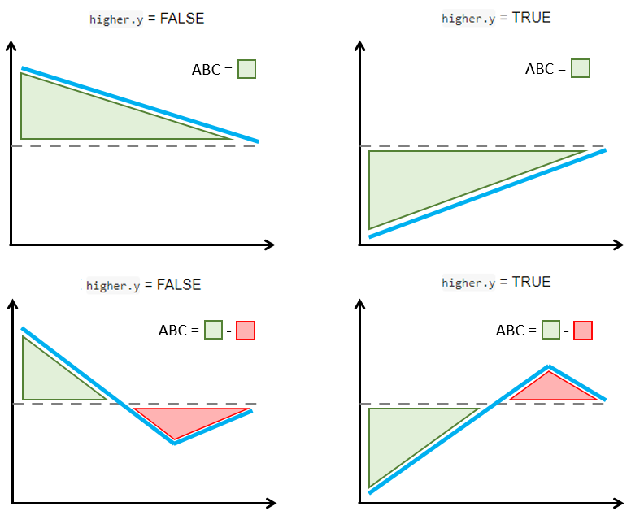

<!-- badges: start -->
[](https://cran.r-project.org/package=precmed)
[](https://cran.r-project.org/package=precmed)
<!-- badges: end -->
```{r setup, include=FALSE}
knitr::opts_chunk$set(echo = TRUE)
knitr::opts_chunk$set(comment = "#>", collapse = TRUE)
options(rmarkdown.html_vignette.check_title = FALSE) #title of doc does not match vignette title
```


<h1>precmed: Precision Medicine in R</h1>
A doubly robust precision medicine approach to estimate and validate conditional average treatment effects


# Theoretical details - Count outcomes

The CATE score represents an individual-level treatment effect expressed as a rate ratio for count outcomes. It can be estimated with boosting, Poisson regression, negative binomial regression, and the doubly robust estimator two regressions [@yadlowsky2020estimation] applied separately by treatment group or with the other doubly robust estimator contrast regression [@yadlowsky2020estimation] applied to the entire data set.

Assume that the following data are recorded for each of $n$ observations:

* $R$ is a binary treatment taking value 0 or 1. 
* $\boldsymbol{X}$ is a vector of $p$ baseline covariates.
* $Y$ is a count outcome.
* $T$ is the exposure time during which $Y$ is recorded. It can vary across observations.

The objective is to estimate the ratio-based CATE score defined as 

$$CATE(\boldsymbol{x})=\text{log}\left(\frac{\mathbb{E}[Y^{(1)}|\boldsymbol{X}=\boldsymbol{x},T=1]}{\mathbb{E}[Y^{(0)}|\boldsymbol{X}=\boldsymbol{x},T=1]}\right)$$
where $Y^{(r)}$ is the potential outcome if the patient received the treatment $r \in \{0,1\}$. $CATE(\boldsymbol{x})$ is interpreted as the individualized log-rate ratio of treatment 1 over treatment 0 conditional on the baseline covariates. 

The package offers 5 methods to estimate the CATE score: Poisson regression, negative binomial regression, boosting, two regressions, and contrast regression.

## Poisson

1. Estimate the conditional mean outcome given baseline covariates and log-transformed exposure time as the offset separately in each treatment group (i.e., $\text{log}(\mathbb{E}[Y^{(r)}|\boldsymbol{x},t])=\beta_r \boldsymbol{\tilde x}$ for $r \in \{0,1\}$ where $\boldsymbol{\tilde x}$ is the $x$ with an intercept) with Poisson regression. Denote the prediction for one time unit as $\hat Y^{(r)}(\boldsymbol{x},1)=\text{exp}(\hat \beta_r \boldsymbol{\tilde x})$.

2. The CATE score with Poisson is the plug-in estimator

$$\hat{CATE}_{Poisson}(\boldsymbol{x})=\text{log}\left(\frac{\hat Y^{(1)}(\boldsymbol{x},1)}{\hat Y^{(0)}(\boldsymbol{x},1)}\right)$$

## Negative binomial

Follow the same step as in Poisson but replace Poisson regression with negative binomial regression in step 1. 

## Boosting

1. Estimate the conditional mean outcome given baseline covariates and log-transformed exposure time as the offset separately in each treatment group (i.e., $\mathbb{E}[Y^{(r)}|\boldsymbol{x},t]$ for $r \in \{0,1\}$) with Poisson-based gradient boosting regression method. Denote the prediction for one time unit as $\hat Y^{(r)}(\boldsymbol{x},1)$.

    * The base learners are regression trees with depth specified with the argument `tree.depth` in `catecvcount()` and `catefitcount()`. Default is 2.
    * The number of trees in boosting is selected via cross-validation with a maximum number of trees specificed with the argument `n.trees` in `catecvcount()` and `catefitcount()`. Default is 200.
    
2. 	The CATE score with boosting is the plug-in estimator

$$\hat{CATE}_{boosting}(\boldsymbol{x})=\text{log}\left(\frac{\hat Y^{(1)}(\boldsymbol{x},1)}{\hat Y^{(0)}(\boldsymbol{x},1)}\right)$$

## Two regressions

1. Randomly separate the data $D$ into $K$ (`Kfold`) non-overlapping parts of approximately equal sizes, $D_1, \dots, D_K$.
2. For each fold $k=1,\dots,K$, and separately by treatment group $r \in \{0,1\}$:

    2.1 Estimate the conditional mean outcome given baseline covariates and log-transformed exposure time as the offset with the
    Poisson-based gradient boosting regression method based on observations without the kth fold, $D_{-k}$, and denote the prediction as $\hat Y_{-k}^{(r)}(\boldsymbol{x},t)$. This is the initial nonparametric prediction of the potential outcome.
    
    2.2 Estimate the PS based on $D_{-k}$. Denote the estimated PS as $\hat \pi_{-k}(\boldsymbol{x})$ and estimate the weights $\hat W(r)=r\frac{R}{\hat \pi_{-k}(\boldsymbol{x})}+(1-r)\frac{(1-R)}{1-\hat \pi_{-k}(\boldsymbol{x})}$ with $R$ denoting the treatment received.
    
    2.3 Solve the following weighted estimating equation by fitting a Poisson regression with $Y$ as the response, $\text{log}(\hat Y^{(r)}(\boldsymbol{x},1))$ and $x$ as the covariates, $\text{log}(T)$ as the offset, and $\hat W(r)$ as weight:
    
    $$S(\alpha_{rk}, \boldsymbol{\gamma_{rk}})=\sum_{i \in D_{-k}} \hat W(r) \pmatrix{\text{log}\left(\hat Y^{(r)}(\boldsymbol{x},1)\right)\\\boldsymbol{\tilde x}}\left(Y - \text{exp}\left(\alpha_{rk}\text{log}\left(\hat Y^{(r)}(\boldsymbol{x},1)\right)+\boldsymbol{\gamma_{rk}^T\boldsymbol{\tilde x}}\right)\times T\right)=0$$
    
    where $i$ denotes individual observations. Denote the roots by $(\hat \alpha_{rk}, \boldsymbol{\hat\gamma_{rk}})$.
    
3. Solve the following doubly robust estimating equation by fitting a Poisson regression with $\text{exp}\left(\hat\alpha_{rk}\text{log}\left(\hat Y^{(r)}(\boldsymbol{x},1)\right)+\boldsymbol{\hat\gamma_{rk}^T\boldsymbol{\tilde x}}\right)$ as the response, $\boldsymbol{x}$ as the covariates, and no offset or weight:
$$S(\boldsymbol{\beta_r})=\sum_{k=1}^K \sum_{i \in D_{-k}}\boldsymbol{\tilde x}\left(\text{exp}\left(\hat\alpha_{rk}\text{log}\left(\hat Y^{(r)}(\boldsymbol{x},1)\right)+\boldsymbol{\hat\gamma_{rk}^T\boldsymbol{\tilde x}}\right)-\text{exp}(\boldsymbol{\beta_r^T\tilde x})\right)=0$$
Denote the estimator as $\boldsymbol{\hat \beta_r}$. 

4. Repeat steps 1-3 with $B$ bootstrap samples and denote the estimator $\boldsymbol{\hat \beta_{rb}}$ in the $b$ sample. The final estimator $\boldsymbol{\hat \beta_r}$ is the mean of the $\boldsymbol{\hat \beta_{rb}}$.

5. The CATE score with two regressions is  

$$\hat{CATE}_{tworeg}(\boldsymbol{x})=(\boldsymbol{\hat \beta_1} - \boldsymbol{\hat \beta_0})^T\boldsymbol{\tilde x}$$

## Contrast regression

1. Randomly separate the data $D$ into $K$ (`Kfold`) non-overlapping parts of approximately equal sizes, $D_1, \dots, D_K$.
2. For each fold $k=1,\dots,K$, and separately by treatment group $r \in \{0,1\}$:

    2.1 Estimate the conditional mean outcome given baseline covariates and log-transformed exposure time as the offset with the
    Poisson-based gradient boosting regression method based on observations without the kth fold, $D_{-k}$, and denote the prediction as $\hat Y_{-k}^{(r)}(\boldsymbol{x},t)$. This is the initial nonparametric prediction of the potential outcome.
    
    2.2 Estimate the PS based on $D_{-k}$. Denote the estimated PS as $\hat \pi_{-k}(\boldsymbol{x})$.
    
3. Solve the following doubly robust estimating equation by Newton-Raphson method or using a L2-norm score method if the former fails to converge:
$$\begin{aligned}
S(\boldsymbol{\delta})&=\sum_{k=1}^K \sum_{i \in D_{-k}} \boldsymbol{\tilde x}\Bigg[\frac{R\left\{\frac{Y}{T}-\frac{1}{2}\left(\hat Y_{-k}^{(0)}(\boldsymbol{ x})\text{exp}(\boldsymbol{\delta^T}\boldsymbol{\tilde x}) + \hat Y_{-k}^{(1)}(\boldsymbol{x})\right)\right\}(1-\hat\pi_{-k}(\boldsymbol{x}))}{\text{exp}(\boldsymbol{\delta^T}\boldsymbol{\tilde x})\hat\pi_{-k}(\boldsymbol{x})+1-\hat\pi_{-k}(\boldsymbol{x})}\\
&+\frac{(1-R)\left\{\frac{Y}{T}-\frac{1}{2}\left(\hat Y_{-k}^{(0)}(\boldsymbol{ x}) + \hat Y_{-k}^{(1)}(\boldsymbol{x})\text{exp}(-\boldsymbol{\delta^T}\boldsymbol{\tilde x})\right)\right\}\text{exp}(\boldsymbol{\delta^T}\boldsymbol{\tilde x})\hat\pi_{-k}(\boldsymbol{x})}{\text{exp}(\boldsymbol{\delta^T}\boldsymbol{\tilde x})\hat\pi_{-k}(\boldsymbol{x})+1-\hat\pi_{-k}(\boldsymbol{x})}\Bigg]=0
\end{aligned}$$
Denote the estimator as $\boldsymbol{\hat\delta}$.

4. Repeat steps 1-3 with $B$ bootstrap samples and denote the estimator $\boldsymbol{\hat \delta_b}$ in the $b$ sample. The final estimator $\boldsymbol{\hat \delta}$ is the mean of the $\boldsymbol{\hat \delta_b}$.

5. The CATE score with contrast regression is  

$$\hat{CATE}_{contrastreg}(\boldsymbol{x})=\boldsymbol{\hat \delta^T\tilde x}$$


## Validation curves and the ABC statistics 
The ABC statistic represents the area between the validation curve and the ATE as described by [@zhao2013effectively]. For a single CV iteration, it is implemented in the training and validation sets separately as following:

**Step 1**. Calculate the ATE in the training or validation sets.

**Step 2**. Calculate the ATE in 100 nested subgroups based on the estimated CATE score and derive the corresponding validation curve. Subgroups are defined with 100 equally-spaced proportions from `min(prop.cutoff)` to `max(prop.cutoff)` to ensure that enough data points are available to build the validation curve.

**Step 3**. The ABC is calculated with `auc()` from `utility.R` using the natural cubic spline interpolation, which calculates the area between the horizontal line with y-intercept at the ATE calculated in **step 1** over the range [`min(prop.cutoff)`,`max(prop.cutoff)`] (*y*) and the validation curve calculated in **step 2** (*x*).


The function `plot()` allows the user to combine validation curves from 2 or more CV iterations (i.e., `cv.n > 1`). There are 2 ways to combine the validation curves:

1. The option `combine`="median" takes the median of the ATEs across all CV iterations in **step 1** and the median of the ATEs in the 100 nested subgroups in **step 2**. 

2. The option `combine`="mean" takes the mean of the ATEs across all CV iterations in **step 1** and the mean of the ATEs in the 100 nested subgroups in **step 2**. 

In either case, the ABC calculations are carried out as in **step 3** with the resulting *x* and *y*.


The figure below explains how the ABC is calculated with a simple schema. The ABC calculations are such that larger positive ABC values always indicate more treatment effect heterogeneity. This is implemented by considering separately the cases when larger or smaller outcomes are preferred.

* If larger count outcomes are preferred (`higher.y = TRUE`, e.g., positive events like number of motor developmental milestones reached), a validation curve above the ATE line and decreasing towards that line is synonym with treatment effect heterogeneity (top left figure). However, sections of the validation curve below the ATE line indicate inability to capture treatment effect heterogeneity (bottom left figure). Hence, the ABC is defined by subtracting the areas below the ATE line (red) from the areas above the ATE line (green) such that larger positive ABC are preferred.

* If smaller count outcomes are preferred (`higher.y = FALSE`, e.g., negative events like number of relapses), a validation curve below the ATE line and increasing towards that line is synonym with treatment effect heterogeneity (top right figure). However, sections of the validation curve above the ATE line indicate inability to capture treatment effect heterogeneity (bottom right figure). Hence, the ABC is defined by subtracting the areas above the ATE line (red) from the areas below the ATE line (green) such that larger positive ABC are preferred. 

```{r, echo = F}
knitr::include_graphics("ABCexample.png")
```
   
ABC calculation examples in relation with `higher.y` argument in `catecv()` and `catefit()`. Validation curves are represented with a blue line and the dashed line is the ATE

# Theoretical details - Survival outcomes

The CATE score represents an individual-level treatment effect for survival data, estimated with random forest, boosting, Poisson regression, and the doubly robust estimator (two regressions, [@yadlowsky2020estimation]) applied separately by treatment group or with the other doubly robust estimators (contrast regression, [@yadlowsky2020estimation]) applied to the entire data set.

Assume that the following data are recorded for each of $n$ observations:

-   $R$ is a binary treatment taking value 0 or 1.
-   $\boldsymbol{X}$ is a vector of $p$ baseline covariates.
-   $T$ is a survival time.
-   $C$ is a censoring time.
-   $Y$ is the minimum between $T$ and $C$.
-   $\delta$ is an indicator taking value 1 if $Y = T$ and 0 otherwise.
-   $\tau$ is a truncation time for restricted mean time lost.

The objective is to estimate the ratio-based CATE score defined as

$$CATE(\boldsymbol{x})=\text{log}\left(\frac{\mathbb{E}[\tau - (T^{(1)} \wedge\tau)|\boldsymbol{X}=\boldsymbol{x}]}{\mathbb{E}[\tau - (T^{(0)} \wedge\tau)|\boldsymbol{X}=\boldsymbol{x}]}\right)$$

where $T^{(r)}$ is the potential survival time if the patient received the treatment $r \in \{0,1\}$. $CATE(\boldsymbol{x})$ is interpreted as the individualized logarithm restricted mean time lost (RMTL) ratio of
treatment 1 over treatment 0 conditional on the baseline covariates. 

The package offers 5 methods to estimate the CATE score: Poisson regression, random forest, boosting, two regressions, and contrast regression.

## Poisson

1.  Estimate the conditional mean RMTL given baseline covariates separately in each treatment group (i.e.,
    $\text{log}(\mathbb{E}[\tau - T\wedge\tau|\boldsymbol{x}, r])=\beta_r \boldsymbol{\tilde x}$
    for $r \in \{0,1\}$ where $\boldsymbol{\tilde x}$ is the $x$ with an intercept) with Poisson regression weighted with IPCW. Denote the prediction as
    $\hat Y^{(r)}(\boldsymbol{x})=\text{exp}(\hat \beta_r \boldsymbol{\tilde x})$.

2.  The CATE score with Poisson is the plug-in estimator

$$\widehat{CATE}_{Poisson}(\boldsymbol{x})=\text{log}\left(\frac{\hat Y^{(1)}(\boldsymbol{x})}{\hat Y^{(0)}(\boldsymbol{x})}\right) = (\hat \beta_1 - \hat \beta_0) \boldsymbol{\tilde x}$$

## Boosting

1.  Estimate the conditional mean RMTL given baseline covariates separately in each treatment group (i.e.,
$\mathbb{E}[Y^{(r)}|\boldsymbol{x}]$ for $r \in \{0,1\}$) with Poisson-based gradient boosting regression method weighted with IPCW. Denote the prediction as $\hat Y^{(r)}(\boldsymbol{x})$.

    -   The number of trees is specificed with the argument
        `n.trees.boosting`. Default is 200.
    -   The depth of trees is specified with the argument `tree.depth`.
        Default is 2.

2.  The CATE score with boosting is the plug-in estimator

$$\widehat{CATE}_{boosting}(\boldsymbol{x})=\text{log}\left(\frac{\hat Y^{(1)}(\boldsymbol{x})}{\hat Y^{(0)}(\boldsymbol{x})}\right)$$

## Random forest

1.  Estimate the conditional mean RMTL given baseline covariates separately in each treatment group (i.e.,
    $\mathbb{E}[Y^{(r)}|\boldsymbol{x}]$ for $r \in \{0,1\}$) with survival random forest. Denote the prediction as
    $\hat Y^{(r)}(\boldsymbol{x})$.

    -   The number of trees in boosting is selected via CV with a maximum number of trees specificed with the argument
        `n.trees.rf`. Default is 1,000.
    -   The base learners are regression trees with depth specified with the argument `tree.depth`. Default is 2.

2.  The CATE score with boosting is the plug-in estimator

$$\widehat{CATE}_{boosting}(\boldsymbol{x})=\text{log}\left(\frac{\hat Y^{(1)}(\boldsymbol{x})}{\hat Y^{(0)}(\boldsymbol{x})}\right)$$

## Two regressions

1.  Randomly separate the data $D$ into $K$ (`Kfold`) non-overlapping parts of approximately equal sizes, $D_1, \dots, D_K$.

2.  For each fold $k=1,\dots,K$, and separately by treatment arm $r \in \{0,1\}$:

    2.1 Estimate the conditional mean RMTL given baseline covariates with the Poisson-based gradient boosting regression method (`initial.predictor.method = "boosting"`) based on observations without the kth fold, $D_{-k}$, and denote the prediction as $\hat Y_{-k}^{(r)}(\boldsymbol{x})$. This is the initial nonparametric prediction of the potential outcome. Other methods can be used to generate an initial prediction (see `initial.predictor.method` argument).

    2.2 Estimate the propensity score model based on $D_{-k}$. Denote the estimated PS as $\hat \pi_{-k}(\boldsymbol{x})$ and estimate the weights $\hat W_{-k}(r)=r\frac{R}{\hat \pi_{-k}(\boldsymbol{x})}+(1-r)\frac{(1-R)}{1-\hat \pi_{-k}(\boldsymbol{x})}$
    with $R$ denoting the treatment received.

    2.3 Estimate the IPCW:

    $$\hat L(r,y) = \frac{\delta+(1-\delta)I(y^{(r)}\geq\tau)}{\hat K_{C^{(r)}}(T \wedge \tau|x)}$$

    where $\hat K_{C^{(r)}}(T \wedge \tau|x)$ is a consistent estimator of the survival function of the censoring time given the covariate $x$, for example, using a Cox model and the Breslow estimator for the cumulative baseline hazard function (`ipcw.method = "breslow"`).

    2.4 Solve the following weighted estimating equation by fitting a Poisson regression with $\tau - (T\wedge\tau)$ as the response, $\text{log}(\hat Y_{-k}^{(r)}(\boldsymbol{x}))$ and $x$ as the covariates, and $\hat K(r,y)\times\hat W_{-k}(r)$ as weight:

    $$S(\alpha_{rk}, \boldsymbol{\gamma_{rk}})=\sum_{i \in D_{-k}} \hat K(r,y) \hat W_{-k}(r) \left((\tau- T\wedge\tau) - \text{exp}\left(\alpha_{rk}\text{log}
     \left(\hat Y_{-k}^{(r)}(\boldsymbol{x})\right)+\boldsymbol{\gamma_{rk}^T}\boldsymbol{\tilde x}\right)\right)=0$$

3.  Solve the following doubly robust estimating equation by fitting a
    Poisson regression with
    $\text{exp}\left(\hat\alpha_{rk}\text{log}\left(\hat Y_{-k}^{(r)}(\boldsymbol{x})\right)+\boldsymbol{\hat\gamma_{rk}^T\boldsymbol{\tilde x}}\right)$
    as the response, $\boldsymbol{x}$ as the covariates, and no offset
    or weight:
    $$S(\boldsymbol{\beta_r})=\sum_{k=1}^K \sum_{i \in D_{k}}\boldsymbol{\tilde x}\left(\text{exp}\left(\hat\alpha_{rk}\text{log}\left(\hat Y_{-k}^{(r)}(\boldsymbol{x})\right)+\boldsymbol{\hat\gamma_{rk}^T\boldsymbol{\tilde x}}\right)-\text{exp}(\boldsymbol{\beta_r^T\tilde x})\right)=0$$
    Denote the estimator as $\boldsymbol{\hat \beta_r}$.

4.  Repeat steps 1-3 with $B$ bootstrap samples (`B`) and denote the estimator $\boldsymbol{\hat \beta_{rb}}$ in the $b$ sample. The final estimator $\boldsymbol{\hat \beta_r}$ is the mean of the  $\boldsymbol{\hat \beta_{rb}}$.

5.  The CATE score with two regression is

$$\widehat{CATE}_{tworeg}(\boldsymbol{x})=(\boldsymbol{\hat \beta_1} - \boldsymbol{\hat \beta_0})^T\boldsymbol{\tilde x}$$

## Contrast regression

1.  Randomly separate the data $D$ into $K$ (`Kfold`) non-overlapping
    parts of approximately equal sizes, $D_1, \dots, D_K$.

2.  For each fold $k=1,\dots,K$, and separately by treatment arm
    $r \in \{0,1\}$:

    2.1 Estimate the conditional mean RMTL given baseline covariates
    with the Poisson-based gradient boosting regression method
    (`initial.predictor.method = "boosting"`) based on observations
    without the kth fold, $D_{-k}$, and denote the prediction as
    $\hat Y_{-k}^{(r)}(\boldsymbol{x})$. This is the initial
    nonparametric prediction of the potential outcome. Other methods can
    be used to generate an initial prediction (see
    `initial.predictor.method` argument).

    2.2 Estimate the propensity score model based on $D_{-k}$. Denote
    the estimated PS as $\hat \pi_{-k}(\boldsymbol{x})$.

    2.3 Estimate the IPCW:

    $$\hat L(r,y) = \frac{\delta+(1-\delta)I(y^{(r)}\geq\tau)}{\hat K_{C^{(r)}}(T \wedge \tau|x)}$$

    where $\hat K_{C^{(r)}}(T \wedge \tau|x)$ is a consistent estimator
    of the survival function of the censoring time given the covariate
    $x$, for example, using a Cox model and the Breslow estimator for
    the cumulative baseline hazard function (`ipcw.method = "breslow"`).

3.  Solve the following doubly robust estimating equation by
    Newton-Raphson method or using a L2-norm score method if the former
    fails to converge: $$\begin{aligned}
    S(\boldsymbol{\delta})&=\sum_{k=1}^K \sum_{i \in D_{k}} \hat L(r,y) \boldsymbol{\tilde x}\Bigg[\frac{R\left\{(\tau - T\wedge\tau)-\text{exp}(\boldsymbol{\delta^T}\boldsymbol{\tilde x})\hat Y_{-k}^{(0)}(\boldsymbol{x})\right\}(1-\hat\pi_{-k}(\boldsymbol{x}))}{\text{exp}(\boldsymbol{\delta^T}\boldsymbol{\tilde x})\hat\pi_{-k}(\boldsymbol{x})+1-\hat\pi_{-k}(\boldsymbol{x})}\\
    &-\frac{(1-R)\left\{(\tau - T\wedge\tau)-\hat Y_{-k}^{(0)}(\boldsymbol{ x}) \right\}\text{exp}(\boldsymbol{\delta^T}\boldsymbol{\tilde x})\hat\pi_{-k}(\boldsymbol{x})}{\text{exp}(\boldsymbol{\delta^T}\boldsymbol{\tilde x})\hat\pi_{-k}(\boldsymbol{x})+1-\hat\pi_{-k}(\boldsymbol{x})}\Bigg]=0
    \end{aligned}$$ Denote the estimator as $\boldsymbol{\hat\delta}$.

4.  Repeat steps 1-3 with $B$ bootstrap samples (`B`) and denote the
    estimator $\boldsymbol{\hat \delta_b}$ in the $b$ sample. The final
    estimator $\boldsymbol{\hat \delta}$ is the mean of the
    $\boldsymbol{\hat \delta_b}$.

5.  The CATE score with contrast regression is

$$\widehat{CATE}_{contrastreg}(\boldsymbol{x})=\boldsymbol{\hat \delta^T\tilde x}$$

## Validation curves and the ABC statistics

The ABC statistic represents the area between the validation curve and the ATE as described by [@zhao2013effectively]. For a single CV iteration and a certain CATE score method, it is implemented as following in the training and validation sets separately:

**Step 1**. Calculate the ATE in the training or validation sets.

**Step 2**. Calculate the ATE in 100 nested subgroups and derive the corresponding validation curve. Subgroups are defined with 100 equally-spaced proportions from `min(prop.cutoff)` to `max(prop.cutoff)` to ensure that enough data points are available to build the validation curve.

**Step 3**. The ABC is calculated with `auc()` from `utility.R` using the natural cubic spline interpolation, which calculates the area between the horizontal line with y-intercept at the ATE calculated in **step 1** (*y*) and the validation curve calculated in **step 2** (*x*) over the range [`min(prop.cutoff)`, `max(prop.cutoff)`].

The function `plot()` allows the user combining validation curves from 2 or more CV iterations (i.e., `cv.n > 1`). There are 2 ways to combine the validation curves:

1.  The option `combine ="median"` takes the median of the ATEs across all CV iterations in **step 1** and the median of the ATEs in the 100 nested subgroups in **step 2**.

2.  The option `combine ="mean"` takes the mean of the ATEs across all CV iterations in **step 1** and the mean of the ATEs in the 100 nested subgroups in **step 2**.

In either case, the ABC calculations are carried out as in **step 3** with the resulting *x* and *y*.

The figure below explains how the ABC is calculated with a simple schema. The ABC calculations are such that larger positive ABC values always indicate more treatment effect heterogeneity. This is implemented by considering separately the cases when larger or smaller outcomes are preferred.

-   If smaller survival outcomes are preferred (`higher.y = FALSE`, e.g., time to a positive event like recovery), a validation curve above the ATE line which decreases towards it is synonym with treatment effect heterogeneity (top left figure). However, sections of the validation curve below the ATE line indicate inability to capture treatment effect heterogeneity (bottom left figure). Hence, the ABC is defined by subtracting the areas below the ATE line from
the areas above the ATE line such that larger positive ABC are preferred.

-   If larger survival outcomes are preferred (`higher.y = TRUE`, e.g., time to a negative event like symptom onset), a validation curve (in blue) below the ATE line (dashed) which increases towards it is synonym with treatment effect heterogeneity (top right figure). However, sections of the validation curve above the ATE line indicate inability to capture treatment effect heterogeneity (bottom right figure). Hence, the ABC is defined by subtracting the areas above the ATE line (in red) from the areas below the ATE line (in green) such that larger positive ABC are preferred.

```{r, echo = F}

```
   
ABC calculation examples in relation with `higher.y` argument in `catecv()` and `catefit()`. Validation curves are represented with a blue line and the dashed line is the ATE.


# Other `precmed` vignettes in this serie  
  
[1. Examples for count outcome](Count-examples.html)  
[2. Examples for survival outcome](Survival-examples.html)  
[3. Additional examples](Additional-examples.html)  
[4. Theoretical details](Theoretical-details.html)    
 


# References  


 
